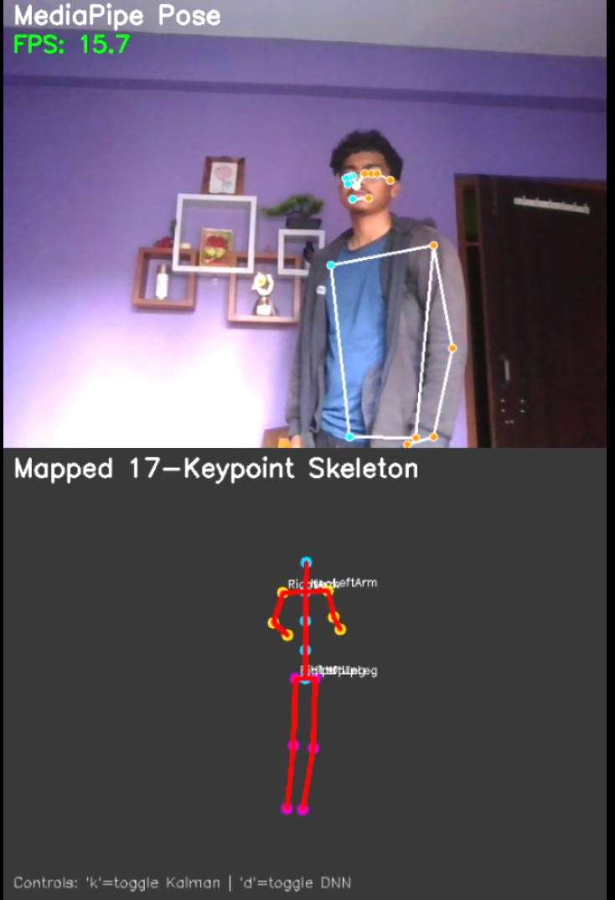
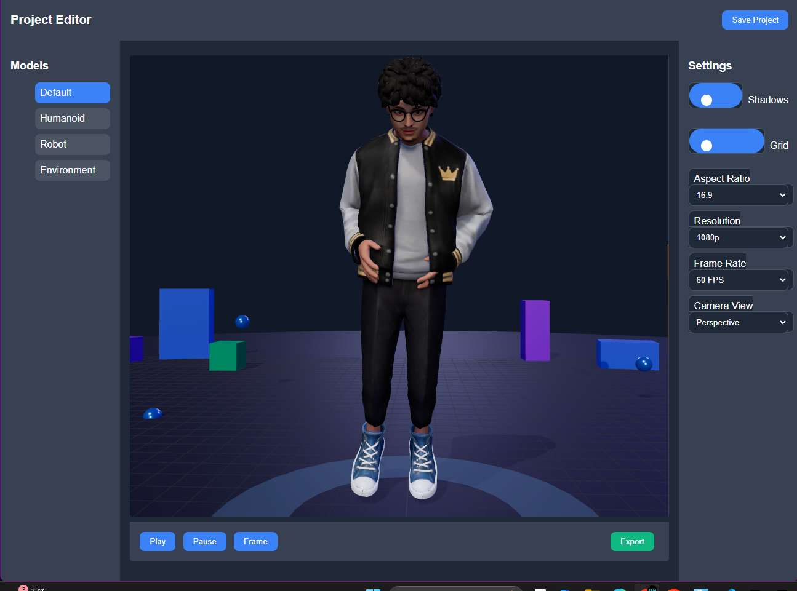

# Real-Time 3D Motion Transfer to Avatar

A complete system for capturing human motion from webcam and transferring it to a 3D avatar in real-time.

Created by [AShok BK](https://github.com/username) and [github.com/username2](https://github.com/username2)



## Features

- Real-time webcam pose detection using MediaPipe
- Custom DNN model for pose correction and refinement
- 17-keypoint skeleton mapping from detected landmarks
- Kalman filtering for smoother motion
- 3D visualization using Three.js
- Real-time motion transfer to 3D avatar models
- WebSocket communication between detection and visualization components
- Vertical display layout showing both MediaPipe output and processed skeleton



## System Requirements

- Python 3.8+ with pip
- Web browser with WebGL support
- VS Code with Live Server extension (recommended for frontend)
- Webcam with clear view of your body

## Installation

1. Clone this repository:

   ```
   git clone https://github.com/yourusername/real-time-avatar-motion.git
   cd real-time-avatar-motion
   ```

2. Create a virtual environment inside the backend_process folder:

   On Windows:

   ```
   mkdir -p backend_process\dependencies
   python -m venv backend_process\dependencies
   backend_process\dependencies\Scripts\activate
   ```

   On macOS/Linux:

   ```
   mkdir -p backend_process/dependencies
   python -m venv backend_process/dependencies
   source backend_process/dependencies/bin/activate
   ```

3. Install required Python packages:

   ```
   pip install -r requirements.txt
   ```

4. If you're using Windows, you can run the `run.bat` file to start the application.
   For Mac/Linux users, follow the manual startup process below.

## Quick Start (Windows)

1. Run the `run.bat` file by double-clicking or from command prompt:

   ```
   run.bat
   ```

2. This will:

   - Activate the virtual environment in backend_process/dependencies
   - Install required dependencies
   - Start the Python backend for pose detection
   - Open the frontend file in VS Code
   - Provide instructions for opening with Live Server

3. Follow the on-screen instructions to open the frontend with Live Server

## Manual Startup

1. Activate the virtual environment:

   On Windows:

   ```
   backend_process\dependencies\Scripts\activate
   ```

   On macOS/Linux:

   ```
   source backend_process/dependencies/bin/activate
   ```

2. Start the Python backend:

   ```
   python backend_process/scripts/capture.py
   ```

   This will start:

   - The webcam capture and pose detection
   - The WebSocket server for communicating with the frontend

3. Serve the frontend:

   - Using VS Code Live Server: Right-click on `frontend_dis/index.html` and select "Open with Live Server"
   - Or using Python's built-in server: `python -m http.server 8000 --directory frontend_dis`

4. Open your browser and navigate to:
   - Live Server: Usually `http://127.0.0.1:5500/frontend_dis/index.html`
   - Python server: `http://localhost:8000/`

## Usage

1. Stand in front of your webcam, ensuring your full body is visible.
2. The application will detect your pose and display:

   - Top: MediaPipe pose detection output
   - Bottom: Processed 17-keypoint skeleton
   - Browser: 3D avatar following your movements

3. Keyboard controls:
   - `k`: Toggle Kalman filter for smoother movement
   - `d`: Toggle DNN correction
   - `q`: Quit the application
   - `s`: Save a screenshot

## Processing Pipeline

The system processes motion in several stages:

1. **MediaPipe Pose Detection**: Captures 33 body landmarks using Google's MediaPipe library
2. **Landmark Selection**: Extracts 12 essential keypoints from the 33 MediaPipe landmarks:
   - Shoulders, elbows, wrists
   - Hips, knees, ankles
3. **DNN Correction**: Applies a neural network to correct and refine keypoint positions
4. **17-Keypoint Mapping**: Creates a full skeleton by:
   - Adding calculated joints (hips center, spine, neck)
   - Organizing joints in a standard hierarchy
5. **Orientation Enrichment**: Calculates rotational information for each joint
6. **Kalman Filtering**: Applies statistical smoothing to reduce jitter and improve motion quality
7. **3D Model Animation**: Transfers processed joint rotations to the avatar's skeleton

## Project Structure

- `backend_process/scripts/`
  - `capture.py` - Main entry point, handles webcam capture and UI display
  - `processing.py` - Core processing logic for keypoint extraction and visualization
  - `quat_cal.py` - Handles quaternion calculations for rotational data
- `backend_process/dependencies/` - Python virtual environment (created during setup)
- `backend_process/models/` - Directory for model files
- `websocket_server.py` - Handles WebSocket communication with the frontend
- `simple_serve.py` - Simple HTTP server for the frontend
- `frontend_dis/` - Frontend files for 3D visualization:
  - `index.html` - Main frontend page
  - `canva.js` - Canvas and Three.js initialization
  - `glb-model.js` - 3D model handling and animation
- `models/dnn_model.pth` - Pre-trained neural network for pose correction

## Technical Details

### Neural Network Architecture

The DNN model consists of a multi-layer perceptron with the following architecture:

- Input: 36 values (12 keypoints × 3 coordinates)
- Hidden layers: 72 → 64 → 50 → 54 neurons
- Output: 36 values (12 corrected keypoints × 3 coordinates)

### 17-Keypoint Skeleton

The system maps MediaPipe's output to a 17-keypoint skeleton including:

- Hips (center)
- Spine (3 points)
- Head and neck
- Arms and hands (6 points)
- Legs and feet (6 points)

### Kalman Filtering

We implement a Kalman filter for each keypoint to reduce noise and jitter:

- State variables: Position (x,y,z) and velocity
- Observation: Raw keypoint positions
- Process noise and measurement covariance are tuned for smooth motion

### WebSocket Communication

- The backend sends 17-keypoint data as JSON via WebSocket
- The frontend receives this data and applies it to the 3D model
- 60Hz update rate for real-time performance

## Troubleshooting

Common issues:

- **No video feed**: Check if your webcam is connected and accessible
- **Poor detection**: Ensure good lighting and that your full body is visible
- **No model movement**: Check WebSocket connection status in browser console
- **DNN correction fails**: Verify the model file exists in correct location
- **Missing dependencies**: Make sure the virtual environment is activated and all packages are installed

## Contributing

Contributions are welcome! Please feel free to submit a Pull Request.

## License

This project is licensed under the MIT License - see the LICENSE file for details.

## Acknowledgements

- [MediaPipe](https://github.com/google/mediapipe) for pose detection
- [Three.js](https://threejs.org/) for 3D visualization
- [ReadyPlayerMe](https://readyplayer.me/) for 3D avatar models
- [PyTorch](https://pytorch.org/) for neural network implementation
