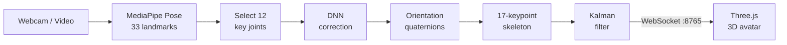

<div align="center">

# Real-Time Motion Transfer to a 3D Avatar

**Capture human motion from a webcam or video and drive a 3D avatar in real time.**

[](https://medium.com/@blazewild215/real-time-motion-capture-animating-your-3d-avatar-with-live-tracking-f5690fe150e5)
[](LICENSE)
[](https://www.python.org/)
[](https://pytorch.org/)
[](https://threejs.org/)

Built by [Ashok BK](https://github.com/blazewild) and [Ashim Nepal](https://github.com/nepalashim)

<a href="https://www.youtube.com/watch?v=PxOQFlTwadE">
  
</a>

<sub>▶ Click the image to watch the demo on YouTube</sub>

</div>

---

## Table of Contents

- [Overview](#overview)
- [Features](#features)
- [How It Works](#how-it-works)
- [Getting Started](#getting-started)
  - [Prerequisites](#prerequisites)
  - [Installation](#installation)
  - [Running the App](#running-the-app)
- [Usage](#usage)
- [Using Your Own Avatar](#using-your-own-avatar)
- [Technical Details](#technical-details)
- [Project Structure](#project-structure)
- [Troubleshooting](#troubleshooting)
- [Contributing](#contributing)
- [License](#license)
- [Acknowledgements](#acknowledgements)

---

## Overview

This project captures body movement from a webcam or a video file and maps it onto a rigged 3D avatar in the browser, in real time.

A Python backend detects the pose with **MediaPipe**, refines the keypoints with a custom **neural network**, smooths them with a **Kalman filter**, and streams the result over **WebSockets**. A **Three.js** frontend receives the data and animates a [Ready Player Me](https://readyplayer.me/) avatar.

## Features

- **Live or recorded input:** use a webcam or any video file
- **Neural pose refinement:** a custom PyTorch model corrects keypoint positions and depth
- **17-keypoint skeleton:** MediaPipe landmarks are mapped to a standard humanoid joint hierarchy
- **Smooth motion:** a per-joint Kalman filter reduces jitter
- **Browser-based 3D view:** the avatar is rendered with Three.js and WebGL
- **Custom avatars:** swap in your own Ready Player Me avatar by changing one URL
- **Runtime toggles:** turn the Kalman filter and the neural correction on and off while the app is running

## How It Works


```mermaid
flowchart LR
    A[Webcam / Video] --> B[MediaPipe Pose<br/>33 landmarks]
    B --> C[Select 12<br/>key joints]
    C --> D[DNN<br/>correction]
    D --> E[Orientation<br/>quaternions]
    E --> F[17-keypoint<br/>skeleton]
    F --> G[Kalman<br/>filter]
    G -- WebSocket :8765 --> H[Three.js<br/>3D avatar]
```

| Stage | Description |
| --- | --- |
| **1. Pose detection** | MediaPipe (BlazePose) extracts 33 world landmarks from each frame. |
| **2. Landmark selection** | 12 core joints are kept: shoulders, elbows, wrists, hips, knees and ankles. |
| **3. DNN correction** | A neural network refines the 12 keypoints for more accurate depth. |
| **4. Orientation enrichment** | Local quaternions are computed for 8 joints to recover rotation along the limb (twist). |
| **5. Skeleton mapping** | Derived joints (hip center, spine, neck) are added to build a 17-keypoint hierarchy. |
| **6. Kalman filtering** | Positions are smoothed over time to reduce jitter. |
| **7. Avatar animation** | Joint rotations are applied to the avatar's skeleton in the browser. |

---

## Getting Started

### Prerequisites

- **Python 3.8–3.11** (the pinned dependencies do not support 3.12 or newer)
- A modern browser with **WebGL** support
- A **webcam**, or a video file to use as input
- An internet connection (the avatar model is loaded from Ready Player Me)
- *Recommended:* [VS Code](https://code.visualstudio.com/) with the [Live Server](https://marketplace.visualstudio.com/items?itemName=ritwickdey.LiveServer) extension
- *Windows only:* [Git Bash](https://git-scm.com/downloads) to use the launcher script

### Installation

**1. Clone the repository**

```bash
git clone https://github.com/BlazeWild/Real-Time-Motion-Transfer-to-a-3D-Avatar.git
cd Real-Time-Motion-Transfer-to-a-3D-Avatar
```

**2. Create and activate a virtual environment** in the project root

<details open>
<summary><b>Windows</b></summary>

```bash
python -m venv venv
venv\Scripts\activate
```

</details>

<details open>
<summary><b>macOS / Linux</b></summary>

```bash
python -m venv venv
source venv/bin/activate
```

</details>

**3. Install the dependencies**

```bash
pip install -r backend_process/requirements.txt
```

### Running the App

#### Option A: Quick start (Windows)

> [!IMPORTANT]
> Run `run.bat` from **Git Bash**, not Command Prompt or PowerShell.

```bash
./run.bat
```

The launcher will:

1. Activate the virtual environment
2. Ask you to choose an input source: **webcam** (default) or **video file**
3. For video input, ask for playback delay, looping, target frame rate and an optional debug mode
4. Start the Python backend in a new window
5. Open `frontend_dis/index.html` in VS Code

Then, in VS Code, right-click `frontend_dis/index.html` and choose **Open with Live Server**.

> [!TIP]
> When asked for a video, you can type just its name (for example `video`). The launcher lists the videos it finds in the common folders, such as `backend_process/videos/`.

#### Option B: Manual start (all platforms)

**1. Start the backend** from the project root, with the virtual environment active:

```bash
# Webcam
python backend_process/scripts/capture.py

# Video file
python backend_process/scripts/capture.py --video backend_process/videos/video.mp4 --delay 1 --frame-rate 30 --loop
```

**2. Serve the frontend** with either of these:

- **VS Code Live Server:** right-click `frontend_dis/index.html` and choose **Open with Live Server**
- **Python's built-in server:**
  ```bash
  python -m http.server 8000 --directory frontend_dis
  ```
  Then open <http://localhost:8000> in your browser.

#### Command-line options

| Flag | Default | Description |
| --- | --- | --- |
| `--video <path>` | *(webcam)* | Path to a video file. If omitted, the webcam is used. |
| `--delay <ms>` | `1` | Delay between frames in milliseconds (video only). Higher values play the video more slowly. |
| `--frame-rate <fps>` | `30` | Target processing frame rate. |
| `--loop` | off | Restart the video when it reaches the end. |

---

## Usage

1. Stand in front of the camera with your **whole body in view**, or start a video.
2. The backend window shows two views:
   - **Top:** raw MediaPipe pose detection
   - **Bottom:** the processed 17-keypoint skeleton
3. The avatar in the browser follows the movement in real time.

### Keyboard controls

Focus the backend's OpenCV window, then press:

| Key | Action |
| :---: | --- |
| <kbd>k</kbd> | Toggle the Kalman filter |
| <kbd>d</kbd> | Toggle the DNN correction |
| <kbd>s</kbd> | Save a screenshot |
| <kbd>q</kbd> | Quit |

---

## Using Your Own Avatar

1. Create an avatar at [Ready Player Me](https://readyplayer.me/).
2. Copy its `.glb` URL from the share link, or download it as **glTF/GLB**.
3. Open [`frontend_dis/glb-model.js`](frontend_dis/glb-model.js) and find the `modelPath` constant (around line 45).
4. Replace the URL with your own, then refresh the browser.

```javascript
// Before
const modelPath = "https://models.readyplayer.me/67be034c9fab1c21c486eb14.glb";

// After
const modelPath = "https://models.readyplayer.me/YOUR_AVATAR_ID.glb";
```

---

## Technical Details

<details>
<summary><b>Neural network architecture</b></summary>

<br>

A fully connected network (MLP) with ReLU activations refines the selected keypoints:

| Layer | Size |
| --- | --- |
| Input | 36 (12 keypoints × 3 coordinates) |
| Hidden layers | 72 → 64 → 50 → 54 |
| Output | 36 (12 corrected keypoints × 3 coordinates) |

The pretrained weights are in `backend_process/models/dnn_model.pth`.

</details>

<details>
<summary><b>17-keypoint skeleton</b></summary>

<br>

| Region | Joints | Count |
| --- | --- | :---: |
| Core | `Hips` (center) | 1 |
| Torso | `Spine1`, `Spine2` | 2 |
| Head | `Neck`, `Head` | 2 |
| Arms | `Arm`, `ForeArm`, `Hand` (left and right) | 6 |
| Legs | `UpLeg`, `Leg`, `Foot` (left and right) | 6 |
| **Total** | | **17** |

</details>

<details>
<summary><b>Kalman filtering</b></summary>

<br>

Each keypoint has its own Kalman filter:

- **State:** position `(x, y, z)` and velocity `(dx, dy, dz)`
- **Measurement:** raw keypoint position
- **Tuning:** the process and measurement noise are set for smooth motion with low lag

</details>

<details>
<summary><b>WebSocket communication</b></summary>

<br>

| Channel | Port | Payload | Rate |
| --- | --- | --- | --- |
| Pose data | `8765` | 17-keypoint data and DNN status | ~50 Hz |
| Video stream | `8766` | Encoded camera or video frames | ~30 FPS |

The frontend reconnects automatically if the backend restarts.

</details>

---

## Project Structure

```text
Real-Time-Motion-Transfer-to-a-3D-Avatar/
├── backend_process/
│   ├── scripts/
│   │   ├── capture.py          # Entry point: webcam/video capture and OpenCV UI
│   │   ├── processing.py       # Keypoint extraction, DNN correction, Kalman filtering
│   │   └── quat_cal.py         # Quaternion and joint-rotation calculations
│   ├── models/                 # Pretrained model weights (.pth)
│   ├── videos/                 # Sample input videos
│   ├── websocket_server.py     # Streams pose data to the frontend (port 8765)
│   ├── video_websocket.py      # Streams video frames to the frontend (port 8766)
│   ├── simple_serve.py         # Minimal HTTP server helper
│   └── requirements.txt        # Python dependencies
├── frontend_dis/
│   ├── index.html              # Main page
│   ├── canva.js                # Three.js scene and canvas setup
│   ├── glb-model.js            # Avatar loading and animation
│   ├── importmap.js            # ES module import map
│   ├── three-shim.js           # Three.js compatibility shim
│   ├── keypoints.json          # Keypoint definitions
│   └── styles.css
├── run.bat                     # Windows launcher (run from Git Bash)
├── LICENSE
└── README.md
```

---

## Troubleshooting

| Problem | Things to check |
| --- | --- |
| **No video feed** | Make sure the webcam is connected and no other app is using it. |
| **Poor detection** | Improve the lighting and keep your whole body in frame. |
| **Avatar doesn't move** | Make sure the backend is running, then look for WebSocket errors in the browser console. Serve the page over `http://`, not `https://`. |
| **DNN correction fails** | Make sure `dnn_model.pth` is in `backend_process/models/`. |
| **`ModuleNotFoundError`** | Activate the virtual environment and run commands from the **project root**. |
| **Install fails** | Use Python 3.8–3.11. The pinned packages have no builds for newer versions. |
| **Page doesn't update** | Hard-refresh the browser (<kbd>Ctrl</kbd>+<kbd>Shift</kbd>+<kbd>R</kbd>) or restart Live Server. |

---

## Contributing

Contributions are welcome.

1. Fork the repository.
2. Create a feature branch: `git checkout -b feature/my-feature`
3. Commit your changes: `git commit -m "Add my feature"`
4. Push the branch: `git push origin feature/my-feature`
5. Open a pull request.

For major changes, please open an issue first to discuss what you'd like to change.

## License

This project is released under the [MIT License](LICENSE).

## Acknowledgements

- [MediaPipe](https://github.com/google/mediapipe) for pose detection
- [PyTorch](https://pytorch.org/) for the neural network
- [Three.js](https://threejs.org/) for 3D rendering
- [Ready Player Me](https://readyplayer.me/) for the avatar models

---

<div align="center">

If you find this project useful, please consider giving it a ⭐

</div>
